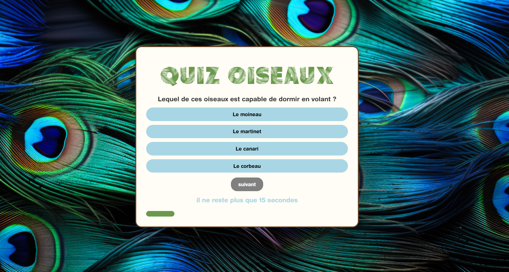

```markdown
# 🐦 Quiz Oiseaux

Un quiz interactif et ludique sur les oiseaux, développé en JavaScript vanilla avec des animations CSS fluides.


## 📋 Table des matières

- [Aperçu](#aperçu)
- [Fonctionnalités](#fonctionnalités)
- [Technologies utilisées](#technologies-utilisées)
- [Installation](#installation)
- [Utilisation](#utilisation)
- [Structure du projet](#structure-du-projet)
- [Auteurs](#auteurs)

## 🎯 Aperçu

Quiz interactif comportant 7 questions sur les oiseaux avec un système de score, un timer, des animations et des retours audio/visuels. Le projet a été réalisé dans le cadre de la formation Ada Tech School.

### Demo

🔗 [Voir la démo en ligne](https://vercel.com/peyre-guillaumes-projects/quiz/AfrwpgfK9D4eYBtYfULRVaZy1B98)

### Captures d'écran



## ✨ Fonctionnalités

- ✅ **7 questions thématiques** sur les oiseaux avec 4 choix de réponse
- ⏱️ **Timer de 20 secondes** par question avec compte à rebours
- 📊 **Système de score** avec pourcentage de réussite
- 📈 **Barre de progression** visuelle
- 🔊 **Effets sonores** pour les bonnes et mauvaises réponses
- 🔇 **Contrôle du son** (activation/désactivation)
- 🎨 **Animations CSS** fluides (oiseau volant, transitions, fade-in)
- 📱 **Design responsive** (mobile-friendly)
- 🎨 **Feedback visuel** immédiat (couleurs, messages)
- 🔄 **Bouton rejouer** pour relancer le quiz

## 🛠️ Technologies utilisées

### Front-end
- **HTML5** - Structure
- **CSS3** - Styles et animations (keyframes, flexbox, transitions)
- **JavaScript ES6+** - Logique applicative (modules, arrow functions)

### Concepts techniques
- Manipulation du DOM
- Event listeners
- Modules ES6 (import/export)
- Gestion d'état
- setInterval / clearInterval
- Animations CSS (@keyframes)

## 📦 Installation

### Prérequis
- Un navigateur web moderne (Chrome, Firefox, Safari, Edge)
- Un serveur local (Live Server, http-server, ou autre)

### Étapes

1. **Cloner le repository**
```bash
git clone https://github.com/PEYREGuillaume34/Quiz.git
cd Quiz
```

2. **Ouvrir avec un serveur local**

Avec VS Code et l'extension Live Server
- Clic droit sur index.html → "Open with Live Server"


## 🎮 Utilisation

1. **Démarrer le quiz** : La première question s'affiche automatiquement
2. **Répondre** : Cliquez sur l'une des 4 propositions
3. **Feedback** : La bonne réponse s'affiche en vert, votre erreur en rouge (si applicable)
4. **Suivant** : Cliquez sur "suivant" pour passer à la question suivante
5. **Score final** : À la fin, votre score s'affiche en pourcentage avec un message personnalisé
6. **Rejouer** : Cliquez sur "rejouer" pour recommencer

### Contrôles
- 🔊 **Bouton son** (en haut à droite) : Active/désactive les effets sonores
- ⏱️ **Timer** : Vous avez 20 secondes par question
- ➡️ **Bouton suivant** : Passer à la question suivante (activé après avoir répondu)

## 📂 Structure du projet

```
Quiz/
│
├── index.html              # Page principale
├── style.css               # Styles et animations
├── game.js                 # Logique principale du jeu
├── questions.js            # Données des questions
├── sons.js                 # Gestion des effets sonores
├── progression.js          # Barre de progression et utilitaires
├── readme.md               # Documentation
│
├── images/                 # Assets visuels
│   ├── imageFond.jpg       # Image de fond
│   ├── 3ooRmV.gif          # GIF de l'oiseau animé
│   └── picto/              # Icônes (son, etc.)
│       ├── volume-2.svg
│       └── volume-x.svg
│
├── Sound/                  # Fichiers audio
│   ├── BIRDTrop_Piauhau hurleur (ID 1762)_LS.mp3
│   └── BIRDSong_Geai des chenes 1 (ID 3453)_LS.mp3
│
└── font/                   # Polices personnalisées
    ├── Palm Leaf Demo.ttf
    └── HelveticaRoundedLT-Bold.otf
```

## 🏗️ Architecture du code

### Modularité

Le projet est organisé en modules ES6 pour une meilleure maintenabilité :

```javascript
// game.js - Point d'entrée
import Quiz from './questions.js';
import { playVrai, playFaux } from './sons.js';
import { progressionBarre, entierPourcent, nouvelleBalise } from './progression.js';
```

### Flux de données

```
Questions (questions.js)
    ↓
Affichage dynamique (game.js)
    ↓
Interaction utilisateur (click events)
    ↓
Validation & Feedback (sons + visuel)
    ↓
Progression (timer + barre)
    ↓
Score final & Page de résultats
```

## 🎨 Points techniques remarquables

### 1. Animations CSS avec keyframes

```css
@keyframes flyWave {
  0%   { left: -200px; top: 100px; }
  25%  { top: 60px; }
  50%  { top: 100px; }
  75%  { top: 140px; }
  100% { left: 100vw; top: 100px; }
}
```

### 2. Gestion du timer

```javascript
let timerId = setInterval(updateTimer, 1000);

function updateTimer() {
    timer--;
    if (timer <= 0) {
        clearInterval(timerId);
        // Désactiver les réponses
    }
}
```

### 3. Toggle du son

```javascript
soundButton.addEventListener("click", () => {
    isSoundEnabled = !isSoundEnabled;
    soundIcon.src = isSoundEnabled 
        ? "images/picto/volume-2.svg" 
        : "images/picto/volume-x.svg";
});
```

## 🎓 Compétences développées

- Manipulation avancée du DOM
- Gestion d'événements JavaScript
- Architecture modulaire (ES6 modules)
- Animations CSS (keyframes, transitions, courbes de Bézier)
- Gestion d'état applicatif
- Responsive design
- UX/UI design
- Gestion du temps (timers, intervals)

## 🐛 Problèmes connus et limitations

- Le timer démarre dès le chargement de la page (amélioration possible : démarrer au premier clic)
- Les questions ne sont pas mélangées (ordre toujours identique)
- Pas de sauvegarde du meilleur score
- Navigation clavier non implémentée (accessibilité)

## 🚀 Améliorations futures

- [ ] Ajouter un écran de démarrage avec instructions
- [ ] Sauvegarder le meilleur score avec `localStorage`
- [ ] Mélanger l'ordre des questions et des réponses
- [ ] Ajouter des niveaux de difficulté
- [ ] Implémenter un mode multijoueur
- [ ] Améliorer l'accessibilité (navigation clavier, ARIA)
- [ ] Ajouter plus de questions
- [ ] Créer des catégories de quiz (oiseaux, mammifères, etc.)

## 👥 Auteurs

Projet réalisé en collaboration avec :
- Vincent
- Iris
- Guillaume
 sur mon [GitHub](https://github.com/PEYREGuillaume34)

Dans le cadre de la formation **Ada Tech School** - 2025

